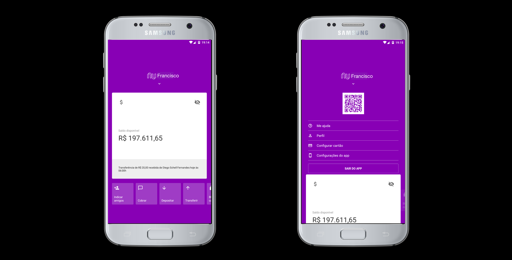

# Nubank Clone (2019)

:iphone: React Native application Animations and Styles

- Based on the study of the [Rocketseat video](https://www.youtube.com/watch?v=DDm0M_rZLJo&t=1048s)

###



### Tools used:

- [Rect Native](https://reactnative.dev/)
- [React Native Gesture Handler](https://github.com/software-mansion/react-native-gesture-handler)
- [Axios](https://github.com/axios/axios)

### Running Locally

```sh
# Install dependencies
yarn install

# Start the metro bundler into a new terminal tab
yarn start

# Start the app android
react-native run-android

# Start the app ios
react-native run-ios --device
```
